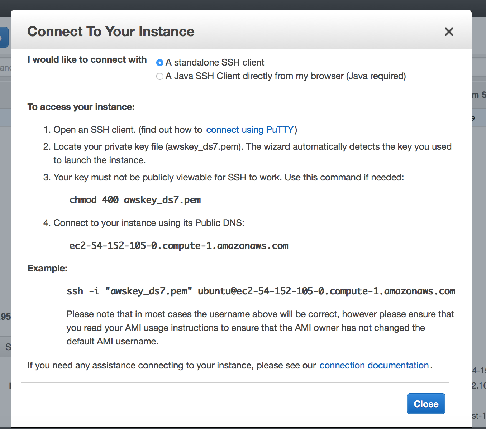

#Amazon Web Services 
##Setting up Cloud Computing :cloud:

1.  Log in  
  http://aws.amazon.com/  
  (Note:  put your user id and password somewhere for easy reference)

2.  [AWS Free Tier](https://aws.amazon.com/free/)  
  * credit card required for log-in
  * designed to enable you to get hands-on experience with AWS Cloud Services
  * includes services with a free tier available for 12 months following your AWS sign-up date, as well as additional service offers that do not automatically expire at the end of your 12 month AWS Free Tier term.

3.  AWS Console  
  Lot of options!  We will choose "Compute/EC2"  [upper left of screen]  
  

4.  Region [on upper right of screen]  
  Select:  US East (N. Virginia)

5.  Create Instance
    From your EC2 Dashboard, click the blue "Launch Instance" button.

---
##Setting up Instance

Step 1) Choose an Amazon Machine Image (AMI):  Ubuntu Server [press blue Select button]  
Step 2) Choose an Instance Type:  Select a "Free tier eligible" "t2.micro" instance  
Step 3) Configure Instance Details:  [accept default]  
Step 4) Add Storage:  [accept default]  
Step 5) Tag Instance: `aws_ds7`  
Step 6) Configure Security Group: Name a new security group and allow some more ports if you like. 80 is a fun port to allow.  
>    Add Rule:  select 'Custom TCP Rule'  
    Port Range: 80  
    Review and Launch / Launch    
    
Step 7) Review Instance Launch: your set-up will look like below screenshot  

  
    
    
---

##Connecting to your Instance  
**Save a screen shot:  this pop-up has very valuable information!**

To access your instance:

    Open an SSH client. (find out how to connect using PuTTY)
    Locate your private key file (awskey_ds7.pem). The wizard automatically detects the key you used to launch the instance.
    Your key must not be publicly viewable for SSH to work. Use this command if needed:

    chmod 400 awskey_ds7.pem

    Connect to your instance using its Public DNS:

    ec2-54-152-105-0.compute-1.amazonaws.com

Example:

    ssh -i "awskey_ds7.pem" ubuntu@ec2-54-152-105-0.compute-1.amazonaws.com

Please note that in most cases the username above will be correct, however please ensure that you read your AMI usage instructions to ensure that the AMI owner has not changed the default AMI username.
If you need any assistance connecting to your instance, please see our connection documentation.

 

